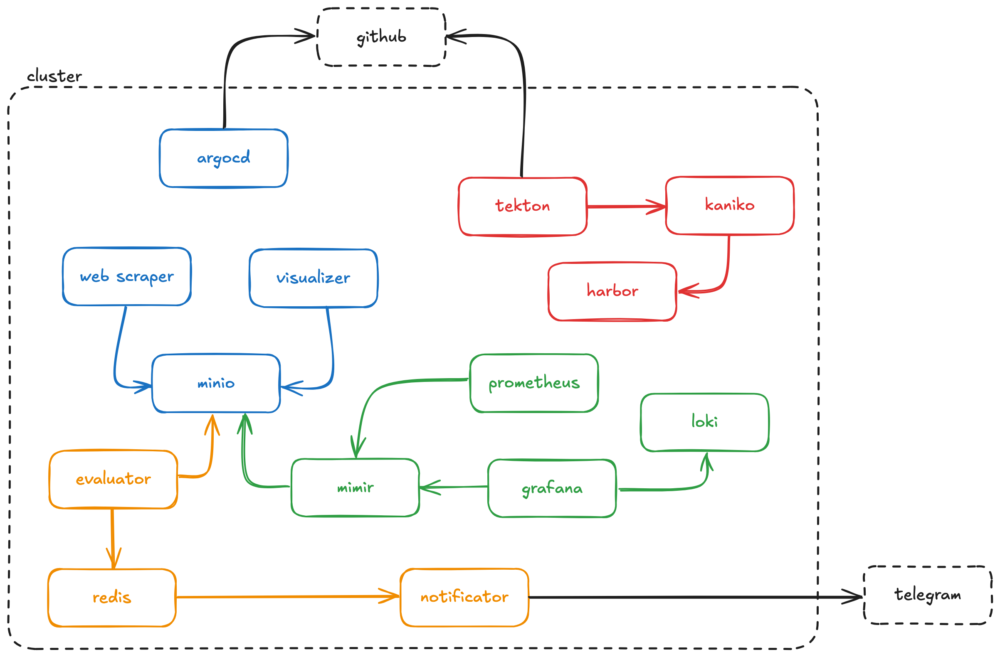

# 🛠️ Kubernetes DevOps Lab

Um laboratório para estudos de práticas devops. Envolve a criação de um cluster para rodar uma aplicação python, com ferramentas de CI/CD, monitoramento e observabilidade, GitOps, etc.

## 🌟 Objetivos

✅ Rodar aplicações Python modulares em containers separados.  
✅ Armazenar dados brutos e históricos em MinIO (S3-compatível).  
✅ Integrar inteligência artificial com scikit-learn.  
✅ Implementar comunicação assíncrona com Redis.  
✅ Automatizar builds e deploys usando Tekton e Argo CD (GitOps).  
✅ Monitorar e visualizar métricas e logs com Prometheus, Grafana e Loki.  
✅ Construir e armazenar imagens Docker internamente usando kaniko e Harbor.

---

## 🔧 Arquitetura

- Container A → MinIO
- Container B → MinIO
- Container C (IA) → MinIO + Redis
- Container Notificador → Redis
- Tekton → Git → kaniko → Harbor
- Argo CD → Git → Kubernetes manifests
- Prometheus → apps + infra metrics
- Grafana → Prometheus + Loki visualização

---

## 📦 Componentes

| Módulo             | Ferramenta         | Descrição                                               |
|---------------------|--------------------|---------------------------------------------------------|
| Dados              | Python             | Processamento e geração de CSV                          |
| IA                | Python + scikit-learn | Análise e julgamento sobre os dados                    |
| Armazenamento      | MinIO             | Bucket S3 interno para CSVs e históricos               |
| Comunicação rápida | Redis             | Pub/Sub para eventos entre IA e notificações          |
| Notificação        | Python             | Envia alertas com base em eventos                     |
| CI                | Tekton Pipelines   | Build automático dentro do cluster (recomendado)     |
| CD (GitOps)        | Argo CD           | Deploys automatizados a partir de Git                |
| Image Builder      | kaniko           | Build de imagens sem docker-in-docker                |
| Container Registry | Harbor           | Armazenamento de imagens Docker                     |
| Observabilidade    | Prometheus + Grafana + Loki | Métricas, logs, dashboards                        |

---

## 💻 Infraestrutura

- **Cluster Kubernetes**: Kind ou kubeadm (mononode ou multinode)
- **Ambiente virtualizado**: Proxmox  
- **Host físico sugerido**:
  - CPU: ≥12 cores / 24 threads
  - RAM: ≥64 GB (ideal 128 GB)
  - Disco: ≥1–2 TB NVMe SSD
  - Fonte: 750W, 80 Plus Bronze ou superior

---

## 🚀 Pipeline de Build & Deploy

1️⃣ Commit no repositório Git.  
2️⃣ Tekton detecta mudanças e dispara pipeline.  
3️⃣ kaniko builda a imagem e empurra para Harbor.  
4️⃣ Argo CD detecta novo manifest no Git e faz deploy no cluster.

---

## 📊 Observabilidade

- **Métricas**: Prometheus scrape containers e nodes.  
- **Logs**: Loki coleta e agrupa logs das aplicações.  
- **Dashboards**: Grafana centraliza visualização.

---

## 🧪 Possíveis evoluções futuras

- Adição de banco de dados (Postgres, Mongo) para histórico enriquecido.  
- Integração de modelos mais pesados (Hugging Face, TensorFlow).  
- Exposição segura de serviços externos (Ingress + TLS).

---

## 📂 Organização dos repositórios

/manifests → Kubernetes manifests, Helm charts, Kustomize
/pipelines → Tekton pipelines
/scripts → Código Python dos containers
/docs → Documentação do lab

---

## 🙌 Créditos e aprendizado

Este projeto foi desenhado para fins laboratoriais, com objetivo de desenvolver habilidades práticas em Kubernetes, CI/CD, observabilidade e arquitetura DevOps moderna.

